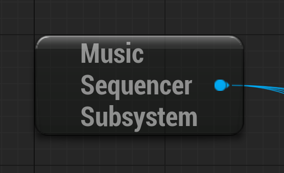

## Music Sequencer Subsystem

The **Music Sequencer Subsystem** provides access to all **Song** _Assets_ at runtime. It is derived from _GameInstanceSubsystem_, making available from when the game or application starts until it closes. Calling the function **`ApplyGameplayTag(...)`** will apply a single _GameplayTag_ to all **Songs**.

### GameplayTags

Using _[GameplayTags](https://dev.epicgames.com/documentation/en-us/unreal-engine/using-gameplay-tags-in-unreal-engine)_ will give you control without needing a **Song** reference or **Scene** name. Just set the _GameplayTags_ and you can freely set and change your custom names.

You can choose to call **`ApplyGameplayTag(...)`** using either a **Song** reference, or the **Music Sequencer Subsystem**.

The _GameplayTags_ that control **Songs** are set in **Song** _Properties_ and **Scene** _Properties_, found in the **Details Tab**.

#### **Song** _GameplayTags_

*   **BeginSongTags**
*   **FinishSongTags**
*   **KillSongTags**

#### **Scene** _GameplayTags_

*   **TriggerSceneTags**

### Accessing the Music Sequencer Subsystem

#### Blueprint

[](img/NodeSubsystem.png)

To add a **Music Sequencer Subsystem** _Blueprint Node_:

*   Right-click the _Blueprint Graph_ background
*   Search for "MusicSequencerSubsystem"
*   Select "Get MusicSequencerSubsystem"

#### C++

To get the **Music Sequencer Subsystem** in C++:

*   Through the _GameInstance_

```
UGameInstance* GameInstance = ...;
UMusicSequencerSubsystem* Subsystem = GameInstance->GetSubsystem<UMusicSequencerSubsystem>();
```

*   Through the static function

```
UWorld* World = ...;
UMusicSequencerSubsystem* Subsystem = UMusicSequencerSubsystem::Get(World);
```
