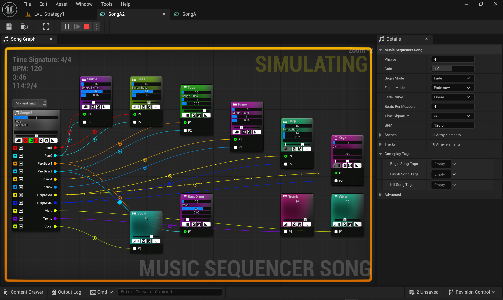
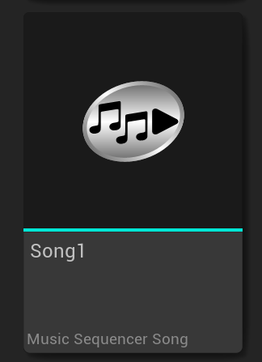
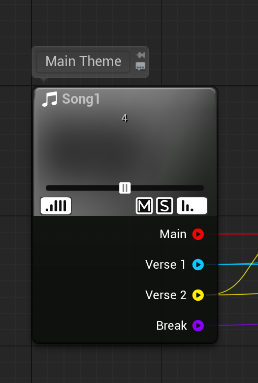
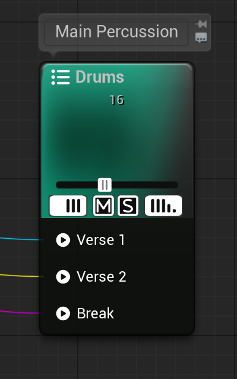
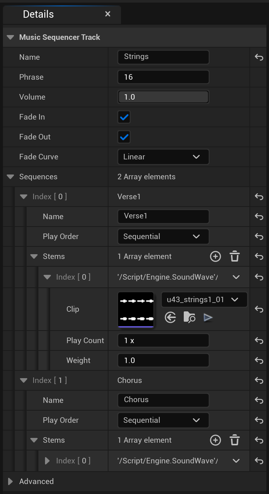

## Song Creation and Editing

<figure>
	<a href="img/SongGraph.png">
	<figcaption>Song Graph</figcaption></a>
</figure>

<figure>
	<a href="img/SongAsset.png">
	<figcaption>Song Asset</figcaption></a>
</figure>

### Song

<figure>
	<a href="img/NodeSong.png">
	<figcaption>Song Node</figcaption></a>
</figure>

A **Song** is a custom _DataAsset_ used by the **Music Sequencer**.

To create a **Song** _Asset_, either right-click inside a blank area of the _Content Browser_, or click the "+Add" toolbar button. Then, from the menu that appears, choose "Audio > Music Sequencer Song".

To edit a **Song** _Asset_, double-click the _Asset_ to open the **Song** _Graph Editor_. There will be one **Song** _Node_ which will include a list of **Scenes**.

Use the _Details Tab_ to set the **Beats Per Measure**, **Time Signature**, and **BPM**.

You can rename a **Song** by renaming the _Asset_ in the _Content Browser_.

### Scenes

A **Scene** is used to **Start** or **Stop Sequences**. **Triggering** a **Scene** is a basic **Song** operation at runtime.

To create a **Scene**, right-click the **Song** _Node_ in the _Graph Editor_. Then from the menu that appears, choose "Add Scene".

You can also drop _SoundWave_ files from the _Content Browser_ onto the **Song** _Node_ to create a new **Scene**.

### Tracks

<figure>
	<a href="img/NodeTrack.png">
	<figcaption>Track Node</figcaption></a>
</figure>

To create a **Track**, either right-click the _Graph Editor_ background, or drag off of a **Song Scene** _Pin_. Then from the menu that appears, choose "New Track".

You can also drop _SoundWave_ files from the _Content Browser_ onto the **Song** _Node_, or onto a **Scene** _Pin_, or onto the _Graph_ background to create a new **Track**.  

### Sequences and Stems

<figure>
	<a href="img/GraphDetails.png">
	<figcaption>Graph Details</figcaption></a>
</figure>

**Sequences** are listed in a **Track**, and **Stems** are listed in a **Sequence**.

To create a **Sequence**, right-click a **Track**. Then from the menu that appears, choose "Add Sequence".

To edit a **Sequence**, select its **Track** _Node_ and modify its properties in the _Details Tab_.

To create and/or edit a **Stem**, select its **Track** and modify its properties in the _Details Tab_.

You can also drop _SoundWave_ files from the _Content Browser_ onto a **Track** _Node_ to create a new **Sequence**, or onto a **Sequence** to add new **Stems**.

### Drag and Drop

#### SoundWave Assets

Dragging one or more _SoundWave_ files onto the _Graph_ will automatically create **Stems** to hold them. The new **Stems** will be created depending on where the files are dropped:

*   Dropping onto the _Graph_ background will add a new **Track** and **Sequence**.
*   Dropping onto the **Song** _Node_ will add a new **Scene** connected to a new **Track** and **Sequence**.
*   Dropping onto a **Scene** _Pin_ will connect it to a new **Track** and **Sequence**.
*   Dropping onto a **Track** _Node_ will add a new **Sequence**.
*   Dropping onto a **Sequence** _Pin_ will add new **Stems** to that **Sequence**.

#### Nodes and Pins

**Triggering** a **Scene** will **Start** or **Stop** all the **Sequences** that are connected to that **Scene's** _Pin_. _Connections_ can be made only between **Scenes** and **Sequences**. Any number of _Connections_ can be made, but a **Scene** can only **Start** one **Sequence** per **Track**.

Dragging _Pins_ to _Nodes_, or _Pins_ to other _Pins_ will create _Connections_ between **Scenes** and **Sequences**. **Scenes** and **Sequences** will be connected, or created, depending on where they are dropped:

*   A **Scene** _Connection_ will **Start** a **Sequence** by default.
*   To create a **Stop** _Connection_, hold `SPACEBAR` while dragging from a _Pin_.
*   To toggle an existing _Connection_ between **Start** and **Stop**, double-click the _Connection_.
*   Dropping a _Pin_ to another _Pin_ will connect a **Scene** to a **Sequence**.
*   Dropping a **Sequence** _Pin_ onto the **Song** _Node_ will connect that **Sequence** to a new **Scene**.
*   Dropping a **Scene** _Pin_ onto a **Track** _Node_ will connect that **Scene** to a new **Sequence**.
